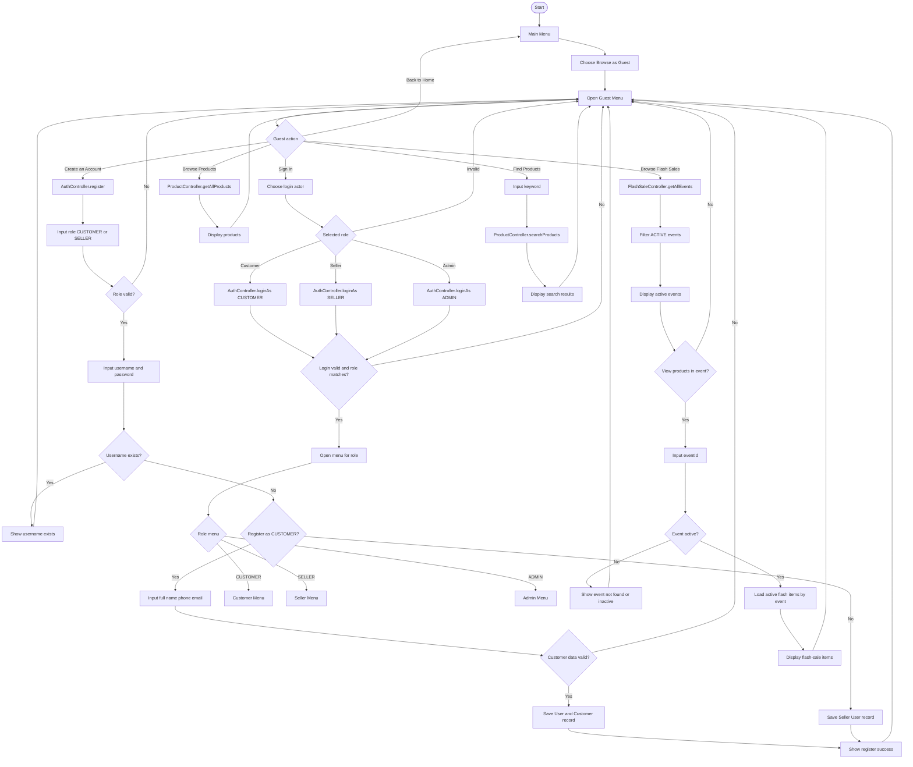
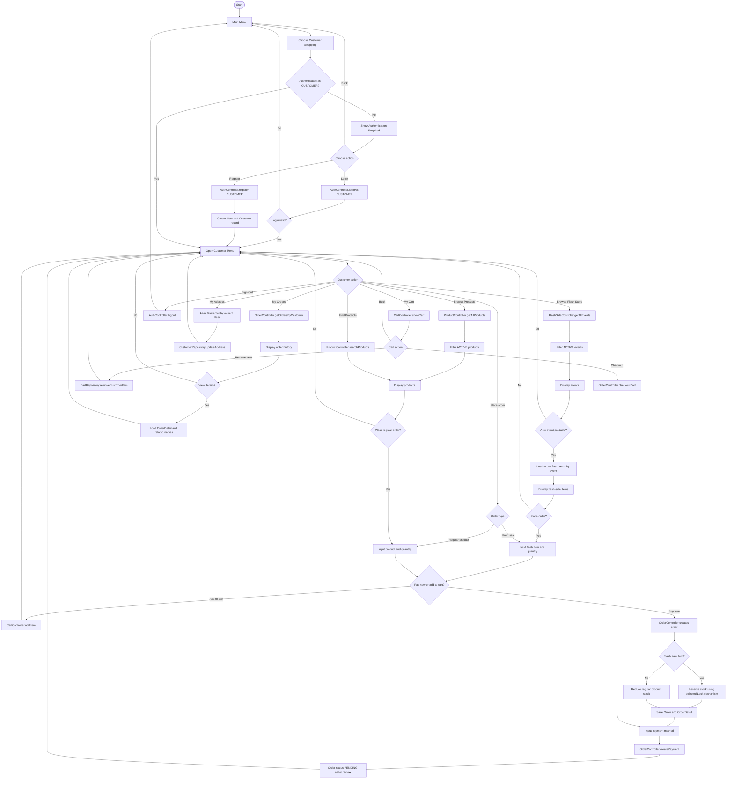
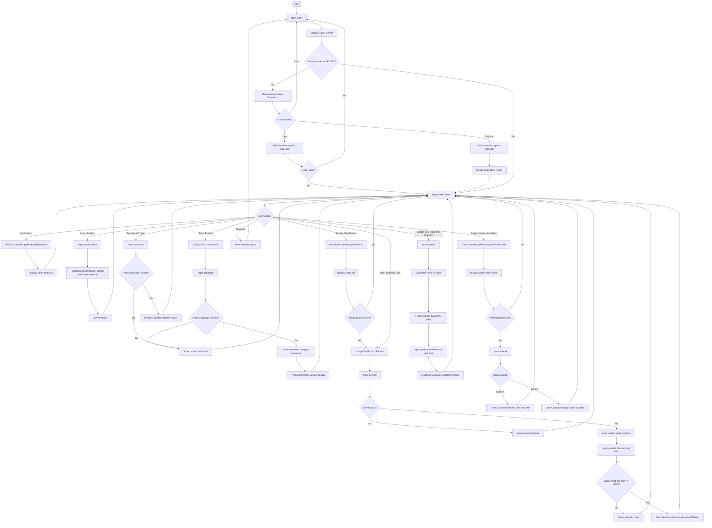
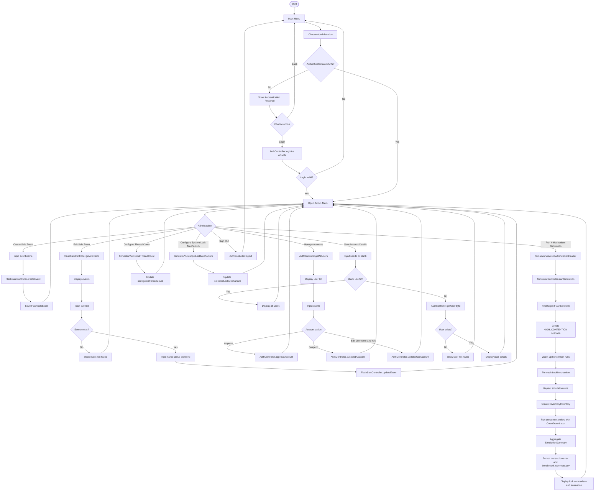

# System Flowcharts 

## 1. Guest Flow

```mermaid
flowchart TD
    A([Start]) --> B[Main Menu]
    B --> C[Choose Browse as Guest]
    C --> D[Open Guest Menu]

    D --> E{Guest action}

    E -- Create an Account --> F[AuthController.register]
    F --> G[Input role CUSTOMER or SELLER]
    G --> H{Role valid?}
    H -- No --> D
    H -- Yes --> I[Input username and password]
    I --> J{Username exists?}
    J -- Yes --> K[Show username exists]
    K --> D
    J -- No --> L{Register as CUSTOMER?}
    L -- Yes --> M[Input full name phone email]
    M --> N{Customer data valid?}
    N -- No --> D
    N -- Yes --> O[Save User and Customer record]
    L -- No --> P[Save Seller User record]
    O --> Q[Show register success]
    P --> Q
    Q --> D

    E -- Sign In --> R[Choose login actor]
    R --> S{Selected role}
    S -- Customer --> T[AuthController.loginAs CUSTOMER]
    S -- Seller --> U[AuthController.loginAs SELLER]
    S -- Admin --> V[AuthController.loginAs ADMIN]
    S -- Invalid --> D
    T --> W{Login valid and role matches?}
    U --> W
    V --> W
    W -- No --> D
    W -- Yes --> X[Open menu for role]
    X --> Y{Role menu}
    Y -- CUSTOMER --> Z[Customer Menu]
    Y -- SELLER --> AA[Seller Menu]
    Y -- ADMIN --> AB[Admin Menu]

    E -- Browse Flash Sales --> AC[FlashSaleController.getAllEvents]
    AC --> AD[Filter ACTIVE events]
    AD --> AE[Display active events]
    AE --> AF{View products in event?}
    AF -- No --> D
    AF -- Yes --> AG[Input eventId]
    AG --> AH{Event active?}
    AH -- No --> AI[Show event not found or inactive]
    AI --> D
    AH -- Yes --> AJ[Load active flash items by event]
    AJ --> AK[Display flash-sale items]
    AK --> D

    E -- Browse Products --> AL[ProductController.getAllProducts]
    AL --> AM[Display products]
    AM --> D

    E -- Find Products --> AN[Input keyword]
    AN --> AO[ProductController.searchProducts]
    AO --> AP[Display search results]
    AP --> D

    E -- Back to Home --> B
```

## 2. Customer Flow

```mermaid
flowchart TD
    A([Start]) --> B[Main Menu]
    B --> C[Choose Customer Shopping]
    C --> D{Authenticated as CUSTOMER?}

    D -- No --> E[Show Authentication Required]
    E --> F{Choose action}
    F -- Login --> G[AuthController.loginAs CUSTOMER]
    F -- Register --> H[AuthController.register CUSTOMER]
    F -- Back --> B
    G --> I{Login valid?}
    H --> J[Create User and Customer record]
    I -- No --> B
    I -- Yes --> K[Open Customer Menu]
    J --> K
    D -- Yes --> K

    K --> L{Customer action}

    L -- Browse Flash Sales --> M[FlashSaleController.getAllEvents]
    M --> N[Filter ACTIVE events]
    N --> O[Display events]
    O --> P{View event products?}
    P -- Yes --> Q[Load active flash items by event]
    P -- No --> K
    Q --> R[Display flash-sale items]
    R --> S{Place order?}
    S -- Yes --> T[Input flash item and quantity]
    S -- No --> K

    L -- Browse Products --> U[ProductController.getAllProducts]
    U --> V[Filter ACTIVE products]
    V --> W[Display products]
    W --> X{Place regular order?}

    L -- Find Products --> Y[ProductController.searchProducts]
    Y --> W

    L -- Place order --> Z{Order type}
    Z -- Flash sale --> T
    Z -- Regular product --> AA[Input product and quantity]
    X -- Yes --> AA
    X -- No --> K

    T --> AB{Pay now or add to cart?}
    AA --> AB
    AB -- Add to cart --> AC[CartController.addItem]
    AC --> K
    AB -- Pay now --> AD[OrderController creates order]
    AD --> AE{Flash-sale item?}
    AE -- Yes --> AF[Reserve stock using selected LockMechanism]
    AE -- No --> AG[Reduce regular product stock]
    AF --> AH[Save Order and OrderDetail]
    AG --> AH
    AH --> AI[Input payment method]
    AI --> AJ[OrderController.createPayment]
    AJ --> AK[Order status PENDING seller review]
    AK --> K

    L -- My Cart --> AL[CartController.showCart]
    AL --> AM{Cart action}
    AM -- Checkout --> AN[OrderController.checkoutCart]
    AN --> AI
    AM -- Remove item --> AO[CartRepository.removeCustomerItem]
    AO --> K
    AM -- Back --> K

    L -- My Orders --> AP[OrderController.getOrdersByCustomer]
    AP --> AQ[Display order history]
    AQ --> AR{View details?}
    AR -- Yes --> AS[Load OrderDetail and related names]
    AR -- No --> K
    AS --> K

    L -- My Address --> AT[Load Customer by current User]
    AT --> AU[CustomerRepository.updateAddress]
    AU --> K

    L -- Sign Out --> AV[AuthController.logout]
    AV --> B
```

## 3. Seller Flow

```mermaid
flowchart TD
    A([Start]) --> B[Main Menu]
    B --> C[Choose Seller Center]
    C --> D{Authenticated as SELLER?}

    D -- No --> E[Show Authentication Required]
    E --> F{Choose action}
    F -- Login --> G[AuthController.loginAs SELLER]
    F -- Register --> H[AuthController.register SELLER]
    F -- Back --> B
    G --> I{Login valid?}
    H --> J[Create Seller User record]
    I -- No --> B
    I -- Yes --> K[Open Seller Menu]
    J --> K
    D -- Yes --> K

    K --> L{Seller action}

    L -- My Products --> M[ProductController.getProductsBySellerId]
    M --> N[Display seller products]
    N --> K

    L -- Add a Product --> O[Input product data]
    O --> P[ProductController.createProduct with current sellerId]
    P --> Q[Save Product]
    Q --> K

    L -- Edit a Product --> R[Load products by sellerId]
    R --> S[Input productId]
    S --> T{Product belongs to seller?}
    T -- No --> U[Show product not found]
    U --> K
    T -- Yes --> V[Input new name category price stock]
    V --> W[ProductController.updateProduct]
    W --> K

    L -- Remove a Product --> X[Input productId]
    X --> Y{Product belongs to seller?}
    Y -- No --> U
    Y -- Yes --> Z[ProductController.deleteProduct]
    Z --> K

    L -- Browse Sale Events --> AA[FlashSaleController.getAllEvents]
    AA --> AB[Display event list]
    AB --> AC{Add product to event?}
    AC -- No --> K
    AC -- Yes --> AD[assignOwnProductToEvent]

    L -- Add Product to Sale --> AD
    AD --> AE[Input eventId]
    AE --> AF{Event exists?}
    AF -- No --> AG[Show event not found]
    AG --> K
    AF -- Yes --> AH[Load current seller products]
    AH --> AI[Input product discount and limit]
    AI --> AJ{Values valid and limit <= stock?}
    AJ -- No --> AK[Show validation error]
    AK --> K
    AJ -- Yes --> AL[FlashSaleController.assignProductToEvent]
    AL --> K

    L -- Update Sale Price and Quantity --> AM[Input eventId]
    AM --> AN[Load flash items in event]
    AN --> AO[Filter products owned by seller]
    AO --> AP[Input product new discount and limit]
    AP --> AQ[FlashSaleController.updateFlashItem]
    AQ --> K

    L -- Review Customer Orders --> AR[OrderController.getPendingOrdersForSeller]
    AR --> AS[Display seller order review]
    AS --> AT{Pending orders exist?}
    AT -- No --> K
    AT -- Yes --> AU[Input orderId]
    AU --> AV{Review action}
    AV -- Confirm --> AW[OrderController.confirmOrderForSeller]
    AV -- Cancel --> AX[OrderController.cancelOrderForSeller]
    AW --> K
    AX --> K

    L -- Sign Out --> AY[AuthController.logout]
    AY --> B
```

## 4. Admin Flow

```mermaid
flowchart TD
    A([Start]) --> B[Main Menu]
    B --> C[Choose Administration]
    C --> D{Authenticated as ADMIN?}

    D -- No --> E[Show Authentication Required]
    E --> F{Choose action}
    F -- Login --> G[AuthController.loginAs ADMIN]
    F -- Back --> B
    G --> H{Login valid?}
    H -- No --> B
    H -- Yes --> I[Open Admin Menu]
    D -- Yes --> I

    I --> J{Admin action}

    J -- Create Sale Event --> K[Input event name]
    K --> L[FlashSaleController.createEvent]
    L --> M[Save FlashSaleEvent]
    M --> I

    J -- Edit Sale Event --> N[FlashSaleController.getAllEvents]
    N --> O[Display events]
    O --> P[Input eventId]
    P --> Q{Event exists?}
    Q -- No --> R[Show event not found]
    R --> I
    Q -- Yes --> S[Input name status start end]
    S --> T[FlashSaleController.updateEvent]
    T --> I

    J -- Manage Accounts --> U[AuthController.getAllUsers]
    U --> V[Display user list]
    V --> W[Input userId]
    W --> X{Account action}
    X -- Approve --> Y[AuthController.approveAccount]
    X -- Suspend --> Z[AuthController.suspendAccount]
    X -- Edit username and role --> AA[AuthController.updateUserAccount]
    Y --> I
    Z --> I
    AA --> I

    J -- View Account Details --> AB[Input userId or blank]
    AB --> AC{Blank userId?}
    AC -- Yes --> AD[Display all users]
    AC -- No --> AE[AuthController.getUserById]
    AE --> AF{User exists?}
    AF -- No --> AG[Show user not found]
    AF -- Yes --> AH[Display user details]
    AD --> I
    AG --> I
    AH --> I

    J -- Configure Thread Count --> AI[SimulatorView.inputThreadCount]
    AI --> AJ[Update configuredThreadCount]
    AJ --> I

    J -- Configure System Lock Mechanism --> AK[SimulatorView.inputLockMechanism]
    AK --> AL[Update selectedLockMechanism]
    AL --> I

    J -- Run 4-Mechanism Simulation --> AM[SimulatorView.showSimulationHeader]
    AM --> AN[SimulatorController.startSimulation]
    AN --> AO[Find target FlashSaleItem]
    AO --> AP[Create HIGH_CONTENTION scenario]
    AP --> AQ[Warm up benchmark runs]
    AQ --> AR[For each LockMechanism]
    AR --> AS[Repeat simulation runs]
    AS --> AT[Create InMemoryInventory]
    AT --> AU[Run concurrent orders with CountDownLatch]
    AU --> AV[Aggregate SimulationSummary]
    AV --> AW[Persist transactions.csv and benchmark_summary.csv]
    AW --> AX[Display lock comparison and evaluation]
    AX --> I

    J -- Sign Out --> AY[AuthController.logout]
    AY --> B
```
